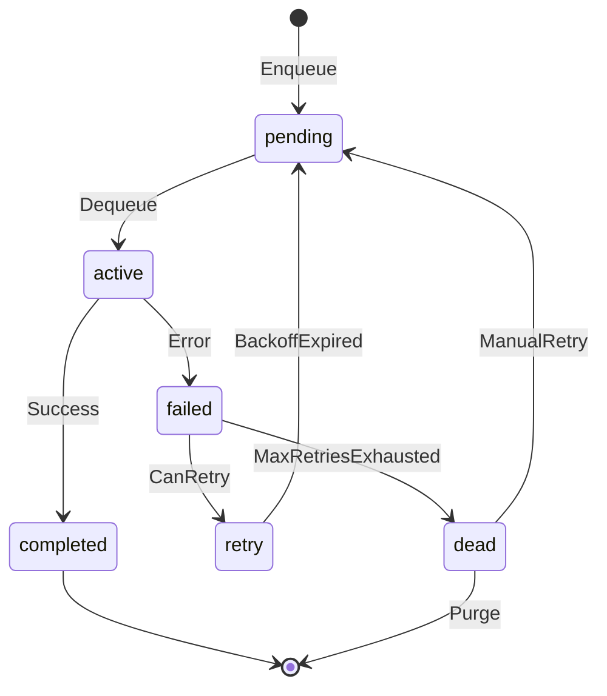
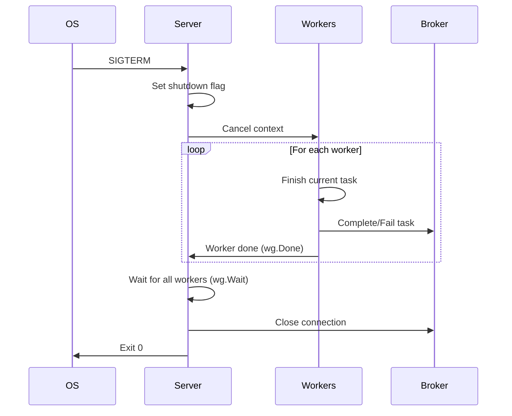

# GoQueue Architecture

This document provides a deep technical overview of GoQueue's internals for engineers who want to understand how the system works.

## Table of Contents

1. [System Overview](#system-overview)
2. [Component Architecture](#component-architecture)
3. [Task Lifecycle](#task-lifecycle)
4. [Redis Data Structures](#redis-data-structures)
5. [Retry Mechanism](#retry-mechanism)
6. [Rate Limiting](#rate-limiting)
7. [Concurrency Model](#concurrency-model)
8. [Graceful Shutdown](#graceful-shutdown)
9. [Design Trade-offs](#design-trade-offs)

---

## System Overview

GoQueue is a distributed task queue with three primary components:

```
┌─────────────────────────────────────────────────────────────────────┐
│                           GoQueue System                            │
├─────────────────────────────────────────────────────────────────────┤
│                                                                     │
│   ┌─────────┐      ┌─────────────┐      ┌─────────────┐            │
│   │ Client  │─────▶│   Redis     │◀─────│   Server    │            │
│   │(Producer)│      │  (Broker)   │      │  (Worker)   │            │
│   └─────────┘      └─────────────┘      └─────────────┘            │
│                           │                    │                    │
│                           ▼                    ▼                    │
│                    ┌─────────────┐      ┌─────────────┐            │
│                    │  Scheduler  │      │   Metrics   │            │
│                    └─────────────┘      └─────────────┘            │
│                                                │                    │
│                                                ▼                    │
│                                         ┌─────────────┐            │
│                                         │  Dashboard  │            │
│                                         └─────────────┘            │
└─────────────────────────────────────────────────────────────────────┘
```

## Component Architecture

### Client (Producer)

The Client enqueues tasks to Redis. It provides a simple API:

```go
type Client struct {
    broker broker.Broker
    config ClientConfig
}
```

**Responsibilities:**
- Create tasks with payloads
- Apply enqueue options (queue, priority, delay)
- Serialize and store tasks in Redis
- Handle immediate and scheduled enqueuing

### Broker (Redis Backend)

The Broker interface abstracts storage operations:

```go
type Broker interface {
    Enqueue(ctx context.Context, task *Task) error
    Dequeue(ctx context.Context, queues []string, timeout time.Duration) (*Task, error)
    Complete(ctx context.Context, task *Task) error
    Fail(ctx context.Context, task *Task, err error) error
    Schedule(ctx context.Context, task *Task, processAt time.Time) error
    // ... additional operations
}
```

The Redis implementation uses pipelining for atomic multi-key operations and sorted sets for priority ordering.

### Server (Worker)

The Server processes tasks using a pool of worker goroutines:

```go
type Server struct {
    broker       broker.Broker
    mux          *Mux           // Task type → Handler mapping
    rateLimiters map[string]*TokenBucket
    // ... lifecycle management
}
```

**Responsibilities:**
- Maintain worker goroutine pool
- Route tasks to registered handlers
- Handle retries and failures
- Enforce rate limits
- Graceful shutdown coordination

### Scheduler

The Scheduler manages delayed and periodic tasks:

```go
type Scheduler struct {
    broker        broker.Broker
    periodicTasks map[string]*PeriodicTask
    // ...
}
```

**Responsibilities:**
- Poll for due scheduled tasks (1-second interval)
- Move ready tasks to their target queues
- Manage periodic task registration and execution

---

## Task Lifecycle

Tasks transition through well-defined states:



### State Definitions

| State | Description |
|-------|-------------|
| `pending` | Waiting in queue to be processed |
| `active` | Currently being processed by a worker |
| `completed` | Successfully processed |
| `failed` | Processing failed (may retry) |
| `retry` | Scheduled for retry after backoff |
| `dead` | Failed permanently, in dead letter queue |

### Task Structure

```go
type Task struct {
    ID         string          // UUID v4
    Type       string          // Handler routing key
    Payload    json.RawMessage // Task data
    Queue      string          // Target queue
    Priority   Priority        // 1-10 (higher = more urgent)
    State      TaskState

    // Retry tracking
    MaxRetries int
    RetryCount int
    LastError  string

    // Timestamps
    CreatedAt   time.Time
    ProcessAt   time.Time // For scheduled tasks
    StartedAt   time.Time
    CompletedAt time.Time
    Deadline    time.Time // Hard deadline
}
```

---

## Redis Data Structures

### Key Schema

```
goqueue:queue:{name}:pending   → Sorted Set (task priorities)
goqueue:queue:{name}:active    → Hash (active task data)
goqueue:scheduled              → Sorted Set (delayed tasks)
goqueue:dlq:{name}             → List (dead letter queue)
goqueue:task:{id}              → String (task JSON)
goqueue:queues                 → Set (known queue names)
goqueue:stats:{name}           → Hash (queue statistics)
```

### Priority Queue Implementation

Tasks are stored in a Redis sorted set with a computed score:

```
score = (maxPriority - priority) × 10^12 + timestamp_nanoseconds
```

This ensures:
1. Higher priority tasks have lower scores (dequeued first)
2. Within same priority, earlier tasks are dequeued first (FIFO)

Example scores:
```
Critical (10): 0 × 10^12 + timestamp = small score (first)
Default  (5):  5 × 10^12 + timestamp = medium score
Low      (1):  9 × 10^12 + timestamp = large score (last)
```

### Dequeue Operation

```lua
-- Conceptual flow (actual implementation uses BZPOPMIN)
1. BZPOPMIN goqueue:queue:{name}:pending TIMEOUT
2. GET goqueue:task:{id}
3. HSET goqueue:queue:{name}:active {id} {task_json}
4. Update task state to "active"
```

### Scheduled Tasks

Scheduled tasks use a separate sorted set with Unix timestamp as score:

```
ZADD goqueue:scheduled {processAt.Unix()} {taskID}
```

The scheduler polls every second:

```go
// Pseudocode
tasks = ZRANGEBYSCORE goqueue:scheduled -inf {now.Unix()} LIMIT 100
for task in tasks:
    ZREM goqueue:scheduled {task.ID}
    Enqueue(task)  // Move to target queue
```

---

## Retry Mechanism

### Exponential Backoff with Jitter

Failed tasks are retried with increasing delays:

```
delay = min(baseDelay × 2^attempt + jitter, maxDelay)
```

Where:
- `baseDelay` = 1 second (configurable)
- `maxDelay` = 1 hour (configurable)
- `jitter` = random value in [0, 0.5 × calculatedDelay]

### Retry Sequence Example

| Attempt | Base Delay | With Jitter (example) |
|---------|------------|----------------------|
| 0 | 1s | 1.0s - 1.5s |
| 1 | 2s | 2.0s - 3.0s |
| 2 | 4s | 4.0s - 6.0s |
| 3 | 8s | 8.0s - 12.0s |
| 4 | 16s | 16.0s - 24.0s |
| 5 | 32s | 32.0s - 48.0s |

### Why Jitter?

Without jitter, if 1000 tasks fail at the same time:
- All retry at exactly 1s → thundering herd
- All retry again at 2s → thundering herd

With jitter, retries are spread across a time window, reducing load spikes.

---

## Rate Limiting

### Token Bucket Algorithm

Each queue can have an independent rate limiter:

```go
type TokenBucket struct {
    rate       float64   // tokens per second
    capacity   float64   // max burst size
    tokens     float64   // current available
    lastRefill time.Time
    mu         sync.Mutex
}
```

**Operation:**
1. Tokens accumulate at `rate` per second up to `capacity`
2. Each task consumes one token
3. If no tokens available, wait or skip queue

**Example Configuration:**
```go
// Allow 100 tasks per minute with burst of 10
WithRateLimit("email", 100, time.Minute)
```

### Why Token Bucket vs Sliding Window?

| Aspect | Token Bucket | Sliding Window |
|--------|--------------|----------------|
| Burst handling | Allows controlled bursts | Strict rate |
| Memory | O(1) | O(n) for window |
| Implementation | Simple | Complex |
| Use case | API rate limits | Strict compliance |

Token bucket is preferred because most external APIs allow some bursting.

---

## Concurrency Model

### Worker Goroutine Topology

```
┌────────────────────────────────────────┐
│              Server.Start()             │
├────────────────────────────────────────┤
│                                        │
│   ┌─────────┐  ┌─────────┐  ┌─────────┐│
│   │Worker 0 │  │Worker 1 │  │Worker N ││
│   └────┬────┘  └────┬────┘  └────┬────┘│
│        │            │            │     │
│        ▼            ▼            ▼     │
│   ┌─────────────────────────────────┐  │
│   │         Broker.Dequeue()         │  │
│   │     (blocks with timeout)        │  │
│   └─────────────────────────────────┘  │
│                                        │
└────────────────────────────────────────┘
```

### Worker Loop

```go
func (s *Server) worker(ctx context.Context, id int, queues []string) {
    for {
        select {
        case <-ctx.Done():
            return
        default:
        }

        // Check rate limits
        if !s.checkRateLimits(queues) {
            time.Sleep(100 * time.Millisecond)
            continue
        }

        // Block waiting for task
        task, err := s.broker.Dequeue(ctx, queues, s.config.PollInterval)
        if err != nil || task == nil {
            continue
        }

        // Process with panic recovery
        s.processTask(ctx, task)
    }
}
```

### Weighted Queue Processing

Queues are processed based on weights:

```go
// Configuration
Queues: {"critical": 6, "default": 3, "low": 1}

// Generates weighted list:
["critical", "critical", "critical", "critical", "critical", "critical",
 "default", "default", "default",
 "low"]
```

BZPOPMIN on this list naturally favors higher-weighted queues.

---

## Graceful Shutdown

### Shutdown Sequence



### Implementation

```go
func (s *Server) Shutdown(ctx context.Context) error {
    // 1. Signal workers to stop accepting new tasks
    s.cancelFunc()

    // 2. Wait for in-flight tasks with timeout
    done := make(chan struct{})
    go func() {
        s.wg.Wait()
        close(done)
    }()

    select {
    case <-done:
        return nil
    case <-ctx.Done():
        return ctx.Err() // Timeout exceeded
    }
}
```

### Timeout Behavior

- **Before timeout:** Workers complete current tasks
- **After timeout:** Server exits, incomplete tasks remain in "active" state
- **Recovery:** Stale active tasks can be requeued via `RequeueStaleActiveTasks()`

---

## Design Trade-offs

### At-Least-Once vs Exactly-Once Delivery

**Choice: At-Least-Once**

GoQueue guarantees tasks are processed at least once. In failure scenarios (worker crash, network partition), tasks may be delivered multiple times.

**Rationale:**
- Exactly-once requires distributed transactions (2PC) or deduplication tables
- At-least-once is sufficient when handlers are idempotent
- Simpler implementation, better performance

**Handler Requirement:** Make handlers idempotent using:
- Unique task IDs for deduplication
- Database constraints
- Idempotency keys for external APIs

### Visibility Timeout vs Heartbeats

**Choice: Visibility Timeout (30 minutes default)**

Active tasks are tracked in a hash. If a worker crashes, tasks remain "active" until manually recovered.

**Alternative (not implemented):** Heartbeat-based tracking where workers periodically extend task visibility. More complex but enables automatic recovery.

### Single Redis vs Redis Cluster

**Current: Single Redis**

GoQueue works with single Redis instance. Cluster support would require:
- Hash tags for related keys (`{queue}:pending`)
- Cross-slot operation handling
- Lua script modifications

**Recommendation:** Use Redis Sentinel for HA with single-master topology.

### Pull vs Push Model

**Choice: Pull (Long Polling)**

Workers poll Redis using `BZPOPMIN` (blocking pop with timeout).

**Trade-offs:**
| Pull | Push |
|------|------|
| Simpler implementation | Complex connection management |
| Workers control load | Risk of overwhelming workers |
| Natural backpressure | Requires explicit flow control |

---

## Performance Characteristics

### Time Complexity

| Operation | Complexity | Notes |
|-----------|------------|-------|
| Enqueue | O(log N) | Sorted set insertion |
| Dequeue | O(1) | BZPOPMIN |
| Complete | O(1) | Hash deletion |
| Get stats | O(1) | Hash + sorted set cardinality |
| Schedule | O(log N) | Sorted set insertion |
| Promote | O(K log N) | K = batch size |

### Memory Usage

Per task overhead:
- Task JSON: ~500 bytes (varies with payload)
- Sorted set entry: ~40 bytes
- Hash entry: ~500 bytes (while active)

For 1 million pending tasks: ~500 MB Redis memory

---

## Future Considerations

1. **PostgreSQL Backend** — For environments without Redis
2. **Result Storage** — Store task results for retrieval
3. **Task Dependencies** — DAG-based workflow execution
4. **Multi-tenancy** — Namespace isolation for SaaS
5. **Observability** — OpenTelemetry tracing integration
