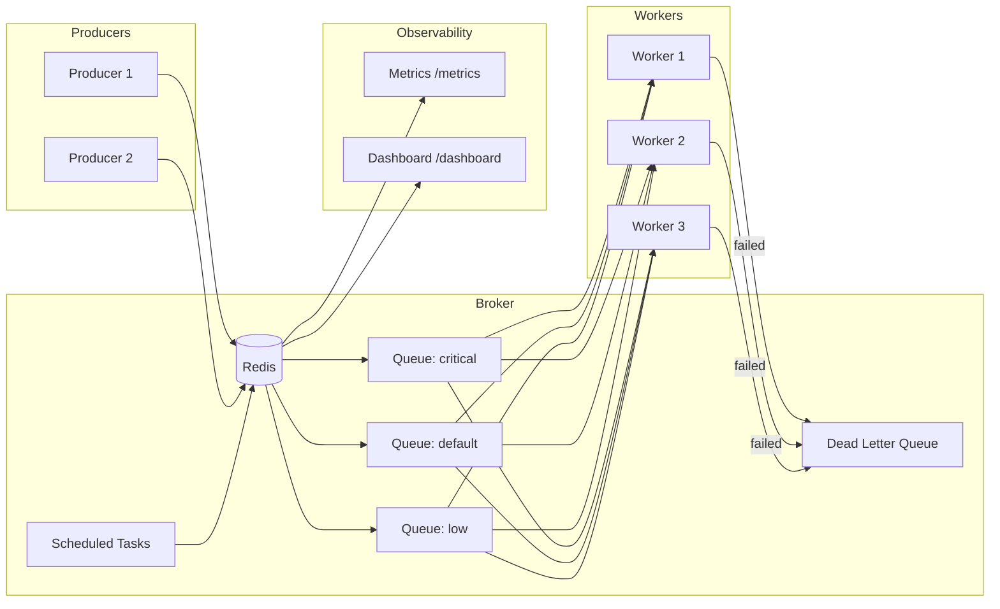

# GoQueue

**A lightweight, high-performance distributed task queue for Go.**

GoQueue is a production-ready task queue library inspired by Celery, Sidekiq, and Asynq. Built from scratch with a focus on simplicity, observability, and fault tolerance, it enables Go applications to reliably process background jobs with automatic retries, dead-letter queues, rate limiting, and real-time metrics.

[](https://go.dev)
[](LICENSE)

---

## Features

- **Priority Queues** — Weighted queue processing with configurable priorities
- **Automatic Retries** — Exponential backoff with jitter for failed tasks
- **Dead Letter Queue** — Failed tasks preserved for inspection and retry
- **Scheduled Tasks** — Delayed and periodic task execution
- **Rate Limiting** — Token bucket algorithm for per-queue rate control
- **Prometheus Metrics** — Built-in observability with detailed metrics
- **Web Dashboard** — Real-time monitoring UI with dark theme
- **Graceful Shutdown** — Clean worker termination on SIGTERM/SIGINT
- **Redis Backend** — Reliable persistence with Redis

## Architecture



## Quick Start

### Installation

```bash
go get github.com/rustamscode/goqueue
```

### Producer Example

```go
package main

import (
    "context"
    "log"

    "github.com/rustamscode/goqueue/pkg/goqueue"
)

func main() {
    client, err := goqueue.NewClient(
        goqueue.WithRedisAddr("localhost:6379"),
    )
    if err != nil {
        log.Fatal(err)
    }
    defer client.Close()

    // Create and enqueue a task
    task, _ := goqueue.NewTask("email:send", map[string]string{
        "to":      "user@example.com",
        "subject": "Welcome!",
    })

    info, err := client.Enqueue(context.Background(), task,
        goqueue.Queue("default"),
        goqueue.MaxRetries(5),
    )
    if err != nil {
        log.Fatal(err)
    }

    log.Printf("Enqueued task: %s", info.ID)
}
```

### Worker Example

```go
package main

import (
    "context"
    "encoding/json"
    "log"

    "github.com/rustamscode/goqueue/pkg/goqueue"
)

func main() {
    server, err := goqueue.NewServer(
        goqueue.WithServerRedisAddr("localhost:6379"),
        goqueue.WithConcurrency(10),
        goqueue.WithQueues(map[string]int{
            "critical": 6,
            "default":  3,
            "low":      1,
        }),
    )
    if err != nil {
        log.Fatal(err)
    }

    server.HandleFunc("email:send", func(ctx context.Context, task *goqueue.Task) error {
        var payload map[string]string
        json.Unmarshal(task.Payload, &payload)
        log.Printf("Sending email to %s", payload["to"])
        return nil
    })

    if err := server.Run(); err != nil {
        log.Fatal(err)
    }
}
```

### Docker (Full Stack)

```bash
# Start Redis, Server, Workers, and Prometheus
docker compose up -d

# Open dashboard
open http://localhost:8080/dashboard

# Run demo producer (enqueues 100 tasks)
docker compose --profile demo up goqueue-producer
```

## Configuration

### Client Options

| Option | Description | Default |
|--------|-------------|---------|
| `WithRedisAddr(addr)` | Redis server address | `localhost:6379` |
| `WithRedisPassword(pwd)` | Redis password | `""` |
| `WithRedisDB(db)` | Redis database number | `0` |

### Server Options

| Option | Description | Default |
|--------|-------------|---------|
| `WithConcurrency(n)` | Number of worker goroutines | `10` |
| `WithQueues(map)` | Queue names with priority weights | `{"default": 1}` |
| `WithShutdownTimeout(d)` | Graceful shutdown timeout | `30s` |
| `WithMaxRetries(n)` | Default max retries per task | `3` |
| `WithRateLimit(queue, rate, interval)` | Per-queue rate limiting | None |

### Enqueue Options

| Option | Description |
|--------|-------------|
| `Queue(name)` | Target queue name |
| `TaskPriority(p)` | Task priority (Low, Default, High, Critical) |
| `MaxRetries(n)` | Override default max retries |
| `ProcessAt(t)` | Schedule for specific time |
| `ProcessIn(d)` | Schedule relative to now |
| `Deadline(t)` | Task must complete by this time |

## Dashboard

The built-in dashboard provides real-time monitoring:

- **Queue Overview** — Pending, active, and dead task counts per queue
- **Throughput** — Tasks processed per minute
- **Dead Letter Queue** — Browse, retry, or delete failed tasks

Access at `http://localhost:8080/dashboard`

## Metrics

GoQueue exports Prometheus metrics at `/metrics`:

| Metric | Type | Labels | Description |
|--------|------|--------|-------------|
| `goqueue_tasks_processed_total` | Counter | queue, status | Total tasks processed |
| `goqueue_tasks_failed_total` | Counter | queue | Total failed tasks |
| `goqueue_tasks_retried_total` | Counter | queue | Total task retries |
| `goqueue_task_duration_seconds` | Histogram | queue, task_type | Processing duration |
| `goqueue_queue_depth` | Gauge | queue | Pending tasks in queue |
| `goqueue_dlq_depth` | Gauge | queue | Tasks in dead letter queue |
| `goqueue_workers_active` | Gauge | — | Currently active workers |

## Architecture Decisions

**Why Redis as the default broker?**
Redis provides the perfect balance of performance, reliability, and simplicity. Sorted sets enable O(log N) priority queue operations, and atomic operations ensure consistency without distributed locking complexity.

**Why exponential backoff with jitter?**
Exponential backoff prevents retry storms when services recover. Jitter (randomization) prevents thundering herd problems when many tasks fail simultaneously.

**Why token bucket for rate limiting?**
Token bucket allows controlled bursting while maintaining average rate limits, ideal for APIs with rate quotas. It's also simple to implement and reason about.

**Why sorted sets for priority queues?**
Redis sorted sets provide O(log N) insertion and O(1) removal of the minimum element, perfect for priority queues. The score encodes both priority level and timestamp for FIFO ordering within priorities.

## Benchmarks

Tested on MacBook Pro M1, Redis 7.0:

| Operation | Throughput | Latency (p99) |
|-----------|------------|---------------|
| Enqueue | 45,000 ops/sec | 0.8ms |
| Dequeue | 38,000 ops/sec | 1.2ms |
| Complete | 42,000 ops/sec | 0.9ms |

## Roadmap

- [ ] PostgreSQL broker backend
- [ ] Task result storage and retrieval
- [ ] OpenTelemetry tracing integration
- [ ] Web UI improvements (task search, payload viewer)
- [ ] Cluster mode with leader election
- [ ] Task dependencies and workflows

## Contributing

See [CONTRIBUTING.md](CONTRIBUTING.md) for development setup and guidelines.

## License

MIT License — see [LICENSE](LICENSE) for details.
